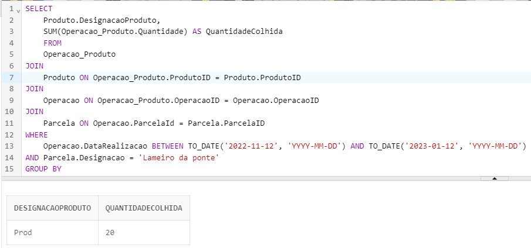

# US BD05
* Como Gestor Agrícola, pretendo saber a quantidade de produtos colhidos numa dada parcela, para cada produto, num dado intervalo de tempo.


### SQL Query

```sql
SELECT Produto.DesignacaoProduto, SUM(Operacao_Produto.Quantidade) AS QuantidadeColhida FROM Operacao_Produto 
    INNER JOIN Produto ON Operacao_Produto.ProdutoID = Produto.ProdutoID
    INNER JOIN Operacao ON Operacao_Produto.OperacaoID = Operacao.OperacaoID
    INNER JOIN Parcela ON Operacao.ParcelaId = Parcela.ParcelaID
    WHERE Operacao.DataRealizacao BETWEEN TO_DATE('2022-11-12', 'YYYY-MM-DD') AND TO_DATE('2023-01-12', 'YYYY-MM-DD')
    AND Parcela.Designacao = 'Lameiro da ponte'
    GROUP BY Produto.DesignacaoProduto;
```

### Caso Prático 

Para o intervalo de tempo entre **2022-11-12'** e **2023-01-12**, o resultado é:


```sql
SELECT Produto.DesignacaoProduto, SUM(Operacao_Produto.Quantidade) AS QuantidadeColhida FROM Operacao_Produto
    INNER JOIN Produto ON Operacao_Produto.ProdutoID = Produto.ProdutoID
    INNER JOIN Operacao ON Operacao_Produto.OperacaoID = Operacao.OperacaoID
    INNER JOIN Parcela ON Operacao.ParcelaId = Parcela.ParcelaID
    WHERE Operacao.DataRealizacao BETWEEN TO_DATE('2022-11-12', 'YYYY-MM-DD') AND TO_DATE('2023-01-12', 'YYYY-MM-DD')
    AND Parcela.Designacao = 'Lameiro da ponte'
    GROUP BY Produto.DesignacaoProduto;
```

### Resultados



### Validação dos Dados


> **Observação:** Na tabela "Operações", aplicou-se um filtro para considerar apenas as operações cuja Data está dentro do intervalo de tempo em estudo e cujo FatorProducao é diferente de NULL.

As imagens das tabelas são mostradas a seguir:


