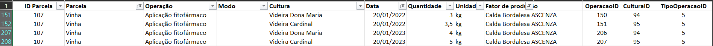
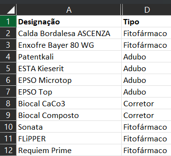

# US BD06
* Como Gestor Agrícola, pretendo saber o numero de factores de produção aplicados numa dada parcela, para cada tipo de factor, num dado intervalo de tempo.


### SQL Query

```sql
SELECT TipoFatorProducao.DescricaoTipoFatorProducao, COUNT(Operacao.OperacaoID) AS NumeroOperacoes FROM Operacao
    INNER JOIN Parcela ON Operacao.ParcelaID = Parcela.ParcelaID
    INNER JOIN FatorProducao ON Operacao.FatorProducaoID = FatorProducao.FatorProducaoID
    INNER JOIN TipoFatorProducao ON FatorProducao.TipoFatorProducaoID = TipoFatorProducao.TipoFatorProducaoID
    WHERE Operacao.DataRealizacao BETWEEN TO_DATE('2022-01-01', 'YYYY-MM-DD') AND TO_DATE('2023-09-15', 'YYYY-MM-DD')
    AND Parcela.Designacao = 'Vinha'
    GROUP BY TipoFatorProducao.DescricaoTipoFatorProducao;
```

### Caso Prático 

Para o intervalo de tempo entre **2022-01-01** e **2023-09-15**, o resultado é:


```sql
SELECT TipoFatorProducao.DescricaoTipoFatorProducao, COUNT(Operacao.OperacaoID) AS NumeroOperacoes FROM Operacao
    INNER JOIN Parcela ON Operacao.ParcelaID = Parcela.ParcelaID
    INNER JOIN FatorProducao ON Operacao.FatorProducaoID = FatorProducao.FatorProducaoID
    INNER JOIN TipoFatorProducao ON FatorProducao.TipoFatorProducaoID = TipoFatorProducao.TipoFatorProducaoID
    WHERE Operacao.DataRealizacao BETWEEN TO_DATE('2022-01-01', 'YYYY-MM-DD') AND TO_DATE('2023-09-15', 'YYYY-MM-DD')
    AND Parcela.Designacao = 'Vinha'
    GROUP BY TipoFatorProducao.DescricaoTipoFatorProducao;
```

### Resultados


### Validação dos Dados


> **Observação:** Na tabela "Operações", aplicou-se um filtro para considerar apenas as operações cuja Data está dentro do intervalo de tempo em estudo e cujo FatorProducao é diferente de NULL.

As imagens das tabelas são mostradas a seguir:




A análise da tabela "Operações" permitiu identificar os fatores de produção aplicados nas operações durante o período em estudo:

| Fator Producao           | Numero de Aplicações |
|--------------------------|---------------------:|
| Calda Bordalesa ASCENZA  |                    2 |
| EPSO Microtop            |                    1 |
| Patentkali               |                    2 |

Consultando a tabela "Fator de Produção", foi possível determinar o tipo de cada fator de produção:

- Calda Bordalesa ASCENZA: Fitofármaco
- EPSO Microtop e Patentkali: Adubo

Desta forma, ao agruparmos os fatores de produção por tipo e somando o número de operações, obtemos o seguinte resultado:

| DESCRICAOTIPOFATORPRODUCAO | NUMEROOPERACOES |
|----------------------------|----------------:|
| Adubo                       |               3 |
| Fitofármaco                 |               2 |

Em resumo, durante o período em estudo, foram realizadas 3 operações utilizando adubos e 2 operações com fitofármacos.
