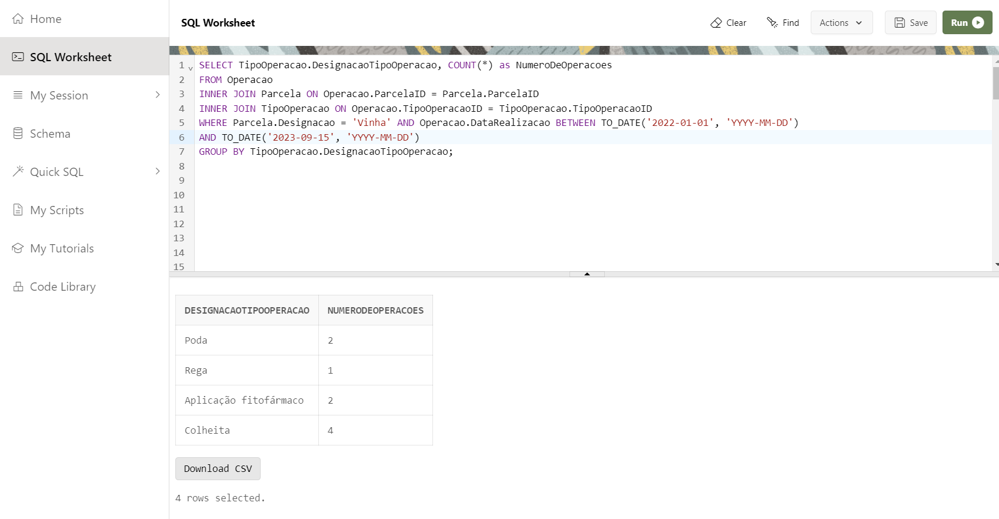
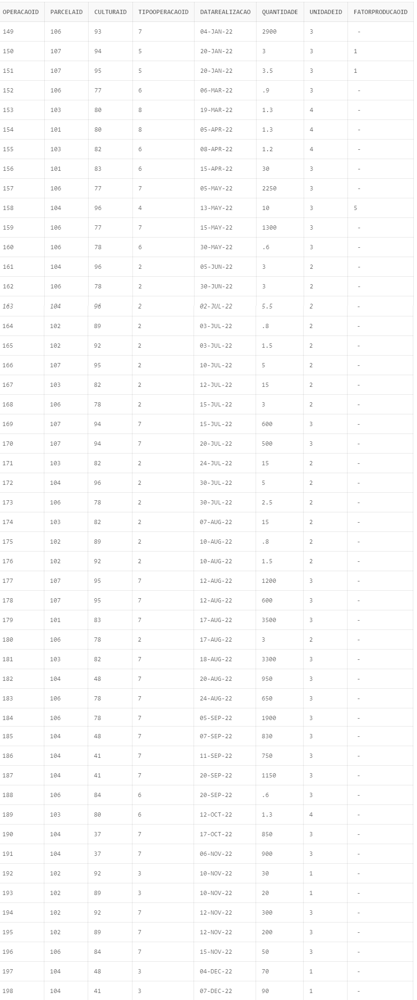
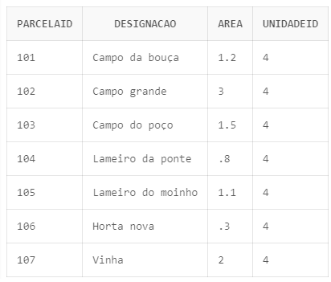
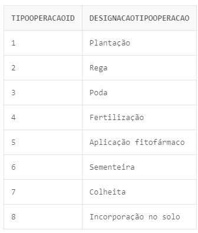

# US BD07
* Como Gestor Agrícola, pretendo saber o numero de operações realizadas numa dada parcela, para cada tipo de operação, num dado intervalo de tempo.


### SQL Query

```sql
SELECT TipoOperacao.DesignacaoTipoOperacao, COUNT(*) as NumberOfOperations FROM Operacao
    INNER JOIN Parcela ON Operacao.ParcelaID = Parcela.ParcelaID
    INNER JOIN TipoOperacao ON Operacao.TipoOperacaoID = TipoOperacao.TipoOperacaoID
    WHERE Parcela.Designacao = 'Vinha' AND Operacao.DataRealizacao BETWEEN TO_DATE('2022-01-01', 'YYYY-MM-DD')
    AND TO_DATE('2023-09-15', 'YYYY-MM-DD')
    GROUP BY TipoOperacao.DesignacaoTipoOperacao;
```

### Caso Prático 

Para o intervalo de tempo entre **2022-01-01** e **2023-09-15**, o resultado é:


```sql
SELECT TipoOperacao.DesignacaoTipoOperacao, COUNT(*) as NumberOfOperations FROM Operacao
    INNER JOIN Parcela ON Operacao.ParcelaID = Parcela.ParcelaID
    INNER JOIN TipoOperacao ON Operacao.TipoOperacaoID = TipoOperacao.TipoOperacaoID
    WHERE Parcela.Designacao = 'Vinha' AND Operacao.DataRealizacao BETWEEN TO_DATE('2022-01-01', 'YYYY-MM-DD')
    AND TO_DATE('2023-09-15', 'YYYY-MM-DD')
    GROUP BY TipoOperacao.DesignacaoTipoOperacao;
```

### Resultados



### Validação dos Dados

Para validar os dados, foram analisados os dados da tabela **Operacao** e **FatorProducao** do ficheiro legacy.

> **Observação:** Na tabela "Operações", aplicou-se um filtro para considerar apenas as operações cuja Data está dentro do intervalo de tempo em estudo e cujo FatorProducao é diferente de NULL.

As imagens das tabelas são mostradas a seguir:




