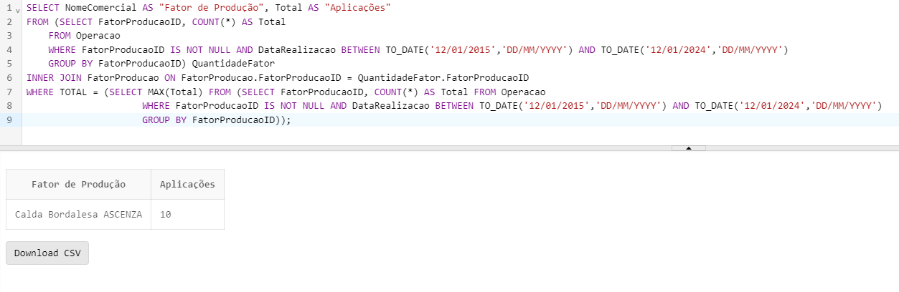
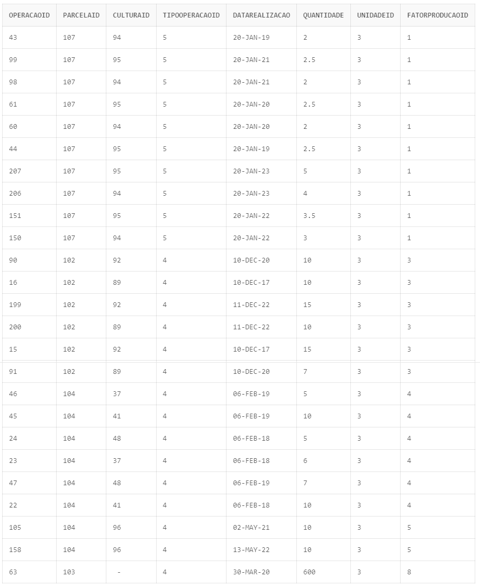
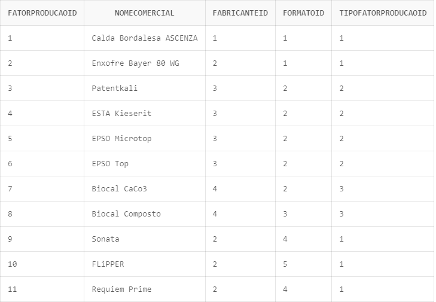

# US BD08
*Como Gestor Agrícola, pretendo saber o factor de produção com mais aplicações na instalação agricula num dado intervalo de tempo.

### SQL Query

```sql
SELECT NomeComercial AS "Fator de Produção", Total AS "Aplicações"
FROM (SELECT FatorProducaoID, COUNT(*) AS Total
      FROM Operacao
      WHERE FatorProducaoID IS NOT NULL AND DataRealizacao BETWEEN TO_DATE('12/01/2015','DD/MM/YYYY') AND TO_DATE('12/01/2024','DD/MM/YYYY')
      GROUP BY FatorProducaoID) QuantidadeFator
         INNER JOIN FatorProducao ON FatorProducao.FatorProducaoID = QuantidadeFator.FatorProducaoID
WHERE TOTAL = (SELECT MAX(Total) FROM (SELECT FatorProducaoID, COUNT(*) AS Total FROM Operacao
                                       WHERE FatorProducaoID IS NOT NULL AND DataRealizacao BETWEEN TO_DATE('data_início','DD/MM/YYYY') AND TO_DATE('data_fim','DD/MM/YYYY')
                                       GROUP BY FatorProducaoID));
```

### Caso Prático 

Para o intervalo de tempo entre **12/01/2015** e **12/01/2024**, o resultado é:


```sql
SELECT NomeComercial AS "Fator de Produção", Total AS "Aplicações"
FROM (SELECT FatorProducaoID, COUNT(*) AS Total
      FROM Operacao
      WHERE FatorProducaoID IS NOT NULL AND DataRealizacao BETWEEN TO_DATE('12/01/2015','DD/MM/YYYY') AND TO_DATE('12/01/2024','DD/MM/YYYY')
      GROUP BY FatorProducaoID) QuantidadeFator
         INNER JOIN FatorProducao ON FatorProducao.FatorProducaoID = QuantidadeFator.FatorProducaoID
WHERE TOTAL = (SELECT MAX(Total) FROM (SELECT FatorProducaoID, COUNT(*) AS Total FROM Operacao
                                       WHERE FatorProducaoID IS NOT NULL AND DataRealizacao BETWEEN TO_DATE('12/01/2015','DD/MM/YYYY') AND TO_DATE('12/01/2024','DD/MM/YYYY')
                                       GROUP BY FatorProducaoID));
```

### Resultados



### Validação dos Dados

Para validar os dados, foram analisados os dados da tabela **Operacao** e **FatorProducao** do ficheiro legacy.

> **Observação:** Na tabela "Operações", aplicou-se um filtro para considerar apenas as operações cuja Data está dentro do intervalo de tempo em estudo e cujo FatorProducao é diferente de NULL.

As imagens das tabelas são mostradas a seguir:




A análise da tabela Operacao permitiu identificar o ID do fator de produção mais aplicado nas operações durante o período em estudo:

| FatorProducaoID | Aplicações |
|-----------------|-----------:|
| 1               |         10 |

Consultando a tabela "Fator de Produção", foi possível determinar a designação do fator de produção:

| FatorProducaoID |                      NomeComum |
|-----------------|-------------------------------:|
| 1               |        Calda Bordalesa ASCENZA |


Em resumo, durante o período em estudo, o fator de produção que mais foi aplicado foi Calda Bordalesa ASCENZA.
