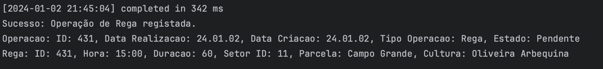
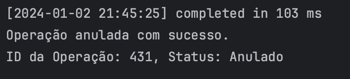
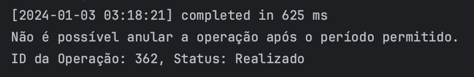

# US BD 30
* USBD30 Como Gestor Agrícola, pretendo anular uma operação que estava prevista e não se realizou ou que foi criada por engano, sabendo que isso só é possível até aos 3 dias seguintes à sua data prevista de execução, se não houver operações posteriores dependentes desta.
### SQL Query

```sql
CREATE OR REPLACE PROCEDURE anular_operacao(
    operacao_id OPERACAO.OPERACAOID%TYPE
) AS
    data_realizacao OPERACAO.DATAREALIZACAO%TYPE;
    estado_operacao OPERACAO.ESTADO%TYPE;
    data_limite DATE;
BEGIN
    -- Obtém o ID da operação a ser anulada
    SELECT DATAREALIZACAO, ESTADO
    INTO data_realizacao, estado_operacao
    FROM Operacao
    WHERE OPERACAOID = operacao_id;
    
    -- Calcula a data limite para anulação (3 dias após a data prevista de execução)
    data_limite := data_realizacao + 3;

    IF TRUNC(SYSDATE) <= TRUNC(data_limite) AND estado_operacao <> 'Realizado' THEN
        -- Atualiza o estado da operação para 'Anulado'
        UPDATE Operacao
        SET Estado = 'Anulado'
        WHERE OperacaoID = operacao_id;

        COMMIT;
        DBMS_OUTPUT.PUT_LINE('Operação anulada com sucesso.');
    ELSE
        DBMS_OUTPUT.PUT_LINE('Não é possível anular a operação após o período permitido.');
    END IF;
EXCEPTION
    WHEN NO_DATA_FOUND THEN
        DBMS_OUTPUT.PUT_LINE('Operação não encontrada.');
WHEN OTHERS THEN
        DBMS_OUTPUT.PUT_LINE('Erro: ' || SQLERRM);
END anular_operacao;
```

### Caso Sucesso 

Para o caso de sucesso é necessário inserir uma operação de rega com data no dia da defesa, setor 11, 60 min, 15:00.

```sql
DECLARE
    setor_id SETOR.SETORID%type := 11;
    data_realizacao OPERACAO.DATAREALIZACAO%type := TO_DATE('2024-01-02', 'YYYY-MM-DD');
    hora_rega REGA.HORA%type := TO_TIMESTAMP( '15:00', 'hh24:mi');
    duracao_rega REGA.DURACAO%type := 60;
    receita_id RECEITA.RECEITAID%type;
    operacao_id OPERACAO.OPERACAOID%type;
    parcela_id PARCELA.PARCELAID%TYPE;
    cultura_id CULTURA.CULTURAID%TYPE;
    especie_vegetal_id ESPECIEVEGETAL.ESPECIEVEGETALID%TYPE;
    designacao_parcela PARCELA.DESIGNACAO%TYPE;
    v_variedade CULTURA.VARIEDADE%TYPE;
    nome_comum ESPECIEVEGETAL.NOMECOMUM%TYPE;
    nome_comercial FATORPRODUCAO.NOMECOMERCIAL%type;
    unidade_designacao UNIDADE.DESCRICAOUNIDADE%TYPE;
BEGIN
    registar_operacao_rega(setor_id, data_realizacao, hora_rega, duracao_rega, receita_id);

    FOR r_operacao IN (
        SELECT Operacao.OPERACAOID, Operacao.DATAREALIZACAO, Operacao.DATACRIACAO, Operacao.TIPOOPERACAO, Operacao.ESTADO
        FROM Operacao
        JOIN REGA ON Operacao.OPERACAOID = REGA.OPERACAOID
        WHERE Operacao.DataRealizacao = data_realizacao
            AND Rega.SetorID = setor_id
            AND Rega.Hora = hora_rega
            AND (Operacao.TipoOperacao = 'Fertirrega' OR (Rega.ReceitaID IS NULL AND Operacao.TipoOperacao = 'Rega'))
    ) LOOP
        operacao_id := r_operacao.OPERACAOID;
        DBMS_OUTPUT.PUT_LINE('Operacao: ' || 'ID: ' || r_operacao.OPERACAOID || ', Data Realizacao: ' || r_operacao.DataRealizacao || ', Data Criacao: ' || r_operacao.DataCriacao ||  ', Tipo Operacao: ' || r_operacao.TipoOperacao || ', Estado: ' || r_operacao.Estado);

        FOR r_rega IN (SELECT * FROM Rega WHERE OperacaoID = operacao_id) LOOP
            SELECT PARCELAID, CULTURAID INTO parcela_id, cultura_id FROM CULTIVO WHERE CULTIVOID = r_rega.CULTIVOID;
            SELECT DESIGNACAO INTO designacao_parcela FROM PARCELA WHERE PARCELAID = parcela_id;
            SELECT ESPECIEVEGETALID, VARIEDADE INTO especie_vegetal_id, v_variedade FROM CULTURA WHERE CULTURAID = cultura_id;
            SELECT NOMECOMUM INTO nome_comum FROM ESPECIEVEGETAL WHERE ESPECIEVEGETALID = especie_vegetal_id;
            DBMS_OUTPUT.PUT_LINE('Rega: ' || 'ID: ' || r_rega.OPERACAOID || ', Hora: ' || TO_CHAR(r_rega.Hora, 'hh24:mi') || ', Duracao: ' || r_rega.Duracao || ', Setor ID: ' || r_rega.SetorID || ', Parcela: ' || designacao_parcela || ', Cultura: ' || nome_comum || ' ' ||  v_variedade);
        END LOOP;

        IF receita_id IS NOT NULL THEN
            FOR r_aplicacao IN (SELECT * FROM AplicacaoFatorProducao WHERE OperacaoID = operacao_id) LOOP
                DBMS_OUTPUT.PUT_LINE( 'Aplicacao Fator Producao' || 'ID: ' || r_aplicacao.OPERACAOID || ', Area: ' || r_aplicacao.Area || ', Parcela: ' || designacao_parcela || ', Cultura: ' || nome_comum || ' ' || v_variedade);
            END LOOP;


            FOR r_fator_producao IN (SELECT * FROM AplicacaoFatorProducao_FatorProducao WHERE OperacaoID = operacao_id) LOOP
                SELECT FATORPRODUCAO.NOMECOMERCIAL
                INTO nome_comercial
                FROM APLICACAOFATORPRODUCAO_FATORPRODUCAO
                JOIN FATORPRODUCAO ON APLICACAOFATORPRODUCAO_FATORPRODUCAO.FatorProducaoID = FATORPRODUCAO.FatorProducaoID
                WHERE APLICACAOFATORPRODUCAO_FATORPRODUCAO.OperacaoID = operacao_id AND FATORPRODUCAO.FATORPRODUCAOID = r_fator_producao.FATORPRODUCAOID;

                SELECT DESCRICAOUNIDADE
                INTO unidade_designacao
                FROM UNIDADE
                WHERE UnidadeID = r_fator_producao.UnidadeID;
                
                DBMS_OUTPUT.PUT_LINE('Fator Producao: ' || nome_comercial || ', Quantidade: ' || r_fator_producao.QuantidadeFatorProducao || ' ' ||  unidade_designacao);
            END LOOP;
        END IF;
        DBMS_OUTPUT.PUT_LINE(CHR(10));
    END LOOP;
EXCEPTION
    WHEN OTHERS THEN
        DBMS_OUTPUT.PUT_LINE('Erro: ' || SQLERRM);
END;
```

Posteriormente, é feita a anular da operação de rega da cultura de Oliveira Arbequina, localizada no campo grande, no dia da defesa, 60 min, 15:00.
Nota: Substituir operacao_id pelo id da operação criada anteriormente.

```sql
DECLARE
    operacao_id OPERACAO.OPERACAOID%TYPE := 431;
BEGIN
    anular_operacao(operacao_id);

    DECLARE
        v_operacao_id OPERACAO.OPERACAOID%TYPE;
        v_operacao_estado OPERACAO.ESTADO%TYPE;
    BEGIN
        SELECT OPERACAOID, ESTADO INTO v_operacao_id, v_operacao_estado
        FROM OPERACAO
        WHERE OPERACAOID = operacao_id;

        DBMS_OUTPUT.PUT_LINE('ID da Operação: ' || v_operacao_id || ', Status: ' || v_operacao_estado);
    EXCEPTION
        WHEN NO_DATA_FOUND THEN
            DBMS_OUTPUT.PUT_LINE('Operação não encontrada');
        WHEN OTHERS THEN
            DBMS_OUTPUT.PUT_LINE('Erro: ' || SQLERRM);
    END;
END;
```

### Resultado

Operação de rega antes da anulação:



O resultado após a anulação é o seguinte:



### Caso Insucesso

Anular operação de rega da cultura de Oliveira Picual, localizada no campo grande, em 02/10/2023, 60 min, 06:00.

```sql
DECLARE
    operacao_id OPERACAO.OPERACAOID%TYPE;
BEGIN
    SELECT Operacao.OPERACAOID INTO operacao_id
    FROM Operacao
         JOIN REGA ON Operacao.OPERACAOID = REGA.OPERACAOID
         JOIN CULTIVO ON REGA.CULTIVOID = CULTIVO.CULTIVOID
         JOIN PARCELA ON CULTIVO.PARCELAID = PARCELA.PARCELAID
         JOIN CULTURA ON CULTIVO.CULTURAID = CULTURA.CULTURAID
         JOIN ESPECIEVEGETAL ON CULTURA.ESPECIEVEGETALID = ESPECIEVEGETAL.ESPECIEVEGETALID
    WHERE Operacao.DataRealizacao = TO_DATE('2023-10-02', 'YYYY-MM-DD')
    AND ESPECIEVEGETAL.NOMECOMUM = 'Oliveira'
    AND CULTURA.VARIEDADE = 'Picual';

    anular_operacao(operacao_id);

    DECLARE
        v_operacao_id OPERACAO.OPERACAOID%TYPE;
        v_operacao_estado OPERACAO.ESTADO%TYPE;
    BEGIN
        SELECT OPERACAOID, ESTADO INTO v_operacao_id, v_operacao_estado
        FROM OPERACAO
        WHERE OPERACAOID = operacao_id;
        
        DBMS_OUTPUT.PUT_LINE('ID da Operação: ' || v_operacao_id || ', Status: ' || v_operacao_estado);
    EXCEPTION
        WHEN NO_DATA_FOUND THEN
            DBMS_OUTPUT.PUT_LINE('Operação não encontrada');
        WHEN OTHERS THEN
            DBMS_OUTPUT.PUT_LINE('Erro: ' || SQLERRM);
    END;
END;

```

### Resultado

O resultado é um erro por já passarem mais de 3 dias sobre a data de realização.

