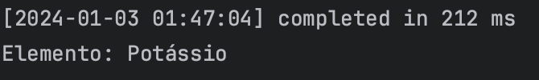
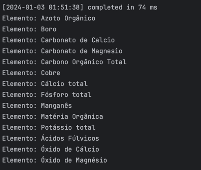

# US BD06
* USBD34 Como Gestor Agrícola, pretendo obter a lista das substâncias de fatores de produção usadas noutros anos civis, mas não usadas no ano civil indicado.

### SQL Query

```sql
CREATE OR REPLACE FUNCTION obter_elementos_utilizados(
    p_ano_indicado VARCHAR2
) RETURN SYS_REFCURSOR AS
    elementos_cursor SYS_REFCURSOR;
BEGIN
    OPEN elementos_cursor FOR
        SELECT DISTINCT Elemento.Designacao
        FROM Elemento
        JOIN FatorProducao_Elemento ON FatorProducao_Elemento.ElementoID = Elemento.ElementoID
        JOIN Monda ON Monda.FatorProducaoID = FatorProducao_Elemento.FatorProducaoID
        JOIN Operacao ON Monda.OPERACAOID = Operacao.OPERACAOID
        WHERE Elemento.ElementoID NOT IN (
            SELECT Elemento.ElementoID
            FROM Monda
             JOIN FatorProducao_Elemento ON Monda.FatorProducaoID = FatorProducao_Elemento.FatorProducaoID
             JOIN Elemento ON FatorProducao_Elemento.ElementoID = Elemento.ElementoID
             JOIN Operacao ON Monda.OPERACAOID = Operacao.OPERACAOID
            WHERE EXTRACT(YEAR FROM Operacao.DataRealizacao) = TO_NUMBER(p_ano_indicado)
        )
        AND Elemento.ElementoID NOT IN (
            SELECT DISTINCT Elemento.ElementoID
            FROM AplicacaoFatorProducao
             JOIN AplicacaoFatorProducao_FatorProducao ON AplicacaoFatorProducao.OperacaoID = AplicacaoFatorProducao_FatorProducao.OperacaoID
             JOIN FatorProducao_Elemento ON AplicacaoFatorProducao_FatorProducao.FatorProducaoID = FatorProducao_Elemento.FatorProducaoID
             JOIN Elemento ON FatorProducao_Elemento.ElementoID = Elemento.ElementoID
             JOIN Operacao ON AplicacaoFatorProducao.OPERACAOID = Operacao.OPERACAOID
            WHERE EXTRACT(YEAR FROM Operacao.DataRealizacao) = TO_NUMBER(p_ano_indicado)
        )
        UNION

        SELECT DISTINCT Elemento.Designacao
        FROM Elemento
         JOIN FatorProducao_Elemento ON FatorProducao_Elemento.ElementoID = Elemento.ElementoID
         JOIN AplicacaoFatorProducao_FatorProducao ON AplicacaoFatorProducao_FatorProducao.FatorProducaoID = FatorProducao_Elemento.FatorProducaoID
         JOIN AplicacaoFatorProducao ON AplicacaoFatorProducao.OperacaoID = AplicacaoFatorProducao_FatorProducao.OperacaoID
         JOIN Operacao ON AplicacaoFatorProducao.OPERACAOID = Operacao.OPERACAOID
        WHERE Elemento.ElementoID NOT IN (
            SELECT Elemento.ElementoID
            FROM Monda
             JOIN FatorProducao_Elemento ON Monda.FatorProducaoID = FatorProducao_Elemento.FatorProducaoID
             JOIN Elemento ON FatorProducao_Elemento.ElementoID = Elemento.ElementoID
             JOIN Operacao ON Monda.OPERACAOID = Operacao.OPERACAOID
            WHERE EXTRACT(YEAR FROM Operacao.DataRealizacao) = TO_NUMBER(p_ano_indicado)
            )
        AND Elemento.ElementoID NOT IN (
            SELECT DISTINCT Elemento.ElementoID
            FROM AplicacaoFatorProducao
             JOIN AplicacaoFatorProducao_FatorProducao ON AplicacaoFatorProducao.OperacaoID = AplicacaoFatorProducao_FatorProducao.OperacaoID
             JOIN FatorProducao_Elemento ON AplicacaoFatorProducao_FatorProducao.FatorProducaoID = FatorProducao_Elemento.FatorProducaoID
             JOIN Elemento ON FatorProducao_Elemento.ElementoID = Elemento.ElementoID
             JOIN Operacao ON AplicacaoFatorProducao.OPERACAOID = Operacao.OPERACAOID
            WHERE EXTRACT(YEAR FROM Operacao.DataRealizacao) = TO_NUMBER(p_ano_indicado)
        );
    RETURN elementos_cursor;
END obter_elementos_utilizados;
```

### Caso Sucesso 1

O seguinte caso de estudo realizado é para o ano de 2023.


```sql
DECLARE
    elementos_cursor SYS_REFCURSOR;
    designacao VARCHAR2(100);
BEGIN
    elementos_cursor := obter_elementos_utilizados('2023');

    LOOP
        FETCH elementos_cursor INTO designacao;

        EXIT WHEN elementos_cursor%NOTFOUND;

        DBMS_OUTPUT.PUT_LINE('Elemento: ' || designacao);
    END LOOP;

    CLOSE elementos_cursor;

END;

```

### Resultado

Para o ano de 2023, o resultado é:



### Caso Sucesso 2

O seguinte caso de estudo realizado é para o ano de 2017.

```sql
DECLARE
    elementos_cursor SYS_REFCURSOR;
    designacao VARCHAR2(100);
BEGIN
    elementos_cursor := obter_elementos_utilizados('2017');

    LOOP
        FETCH elementos_cursor INTO designacao;

        EXIT WHEN elementos_cursor%NOTFOUND;

        DBMS_OUTPUT.PUT_LINE('Elemento: ' || designacao);
    END LOOP;

    CLOSE elementos_cursor;

END;

```

### Resultado

Para o ano de 2017, o resultado é:



